
<h1 align="center">疫苗预约系统+vue</h1>

## 简介
疫苗预约系统：角色分为管理员、用户；提供疫苗信息管理、预约管理、论坛互动、公告信息管理等功能，实现高效便捷的疫苗预约与信息管理。    --计算机毕业设计源码；毕设源码；java毕业设计源码

## 联系方式

<h3 align="center">获取完整代码与数据库文件 + 微信：deepguan QQ: 86050149 QQ群: 783742310</h3>

<h3 align="center">可帮忙远程部署 包运行成功！提供远程部署、修改代码、设计文档指导、代码讲解等服务！</h3>

## 功能介绍（完整见运行截图）
管理员： 基本功能包括登录和退出，同时可以进行管理员管理、用户管理、公告信息管理、疫苗信息管理和预约疫苗管理。在疫苗预约管理模块中，管理员可以查看、查询、删除和管理用户的预约记录，包括疫苗名称、类型、用户信息、预约日期等。此外，管理员可以在论坛和公告中进行回复管理，并通过系统界面对用户信息和基础数据进行修改。个人中心中，管理员可以查看和修改个人信息。

用户： 基本功能包括用户登录和退出，以及访问个人中心。在个人中心，用户可以查看和修改个人资料，包括用户名、联系电话、联系方式等，并支持头像的上传和信息更新。在疫苗预约模块中，用户可以通过系统进行疫苗预约，输入预约日期、时间段和预约人数，并随时查看预约状态。用户还可以在论坛中查看和发布帖子，参与公告栏信息浏览和搜索，查看疫苗相关信息与科学防疫知识。

## 运行截图
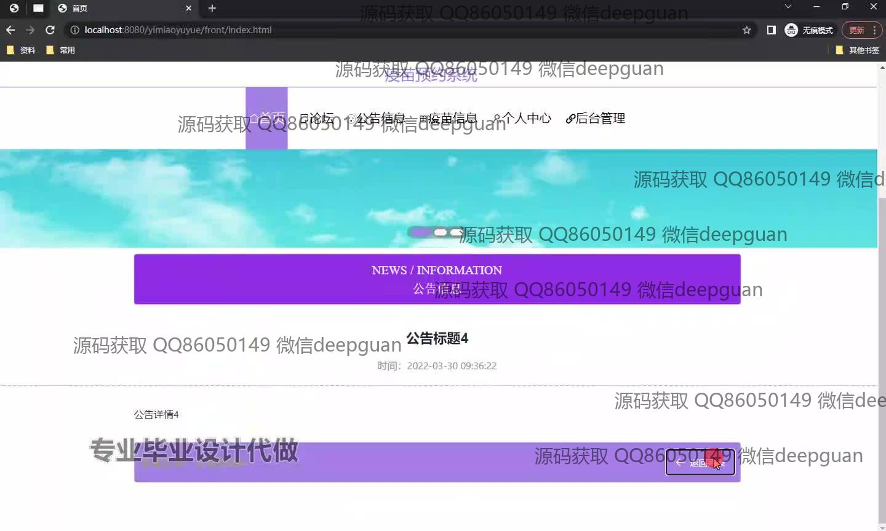
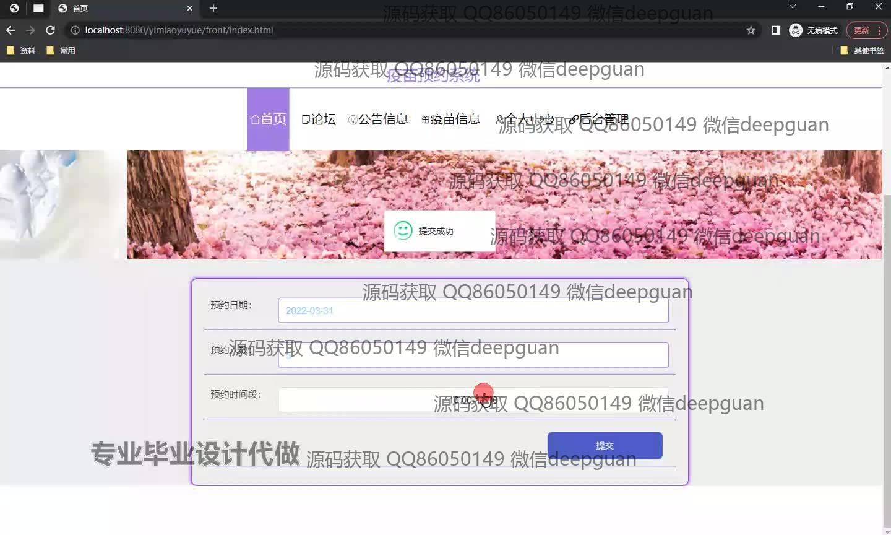
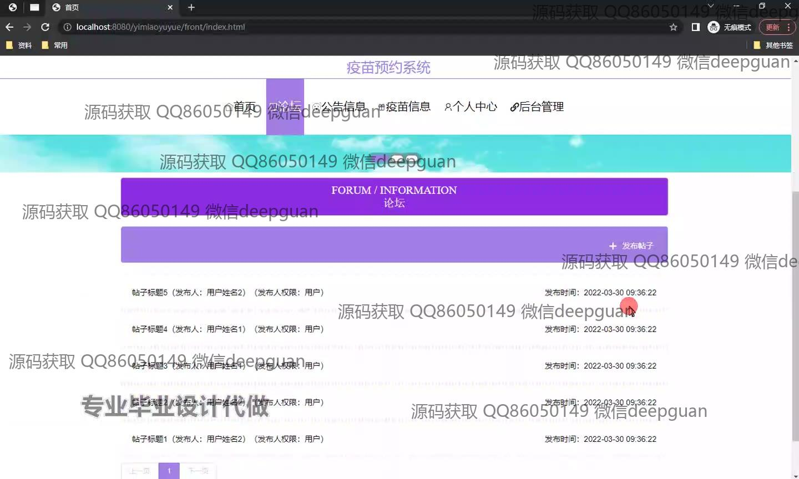
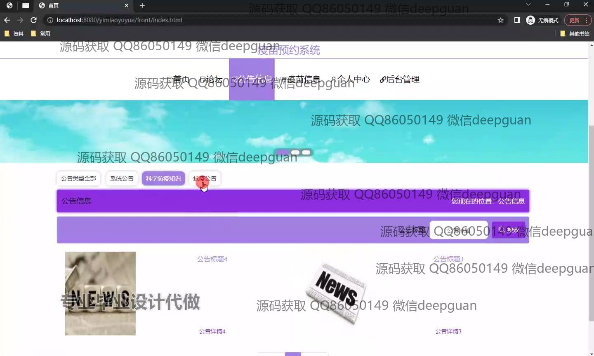
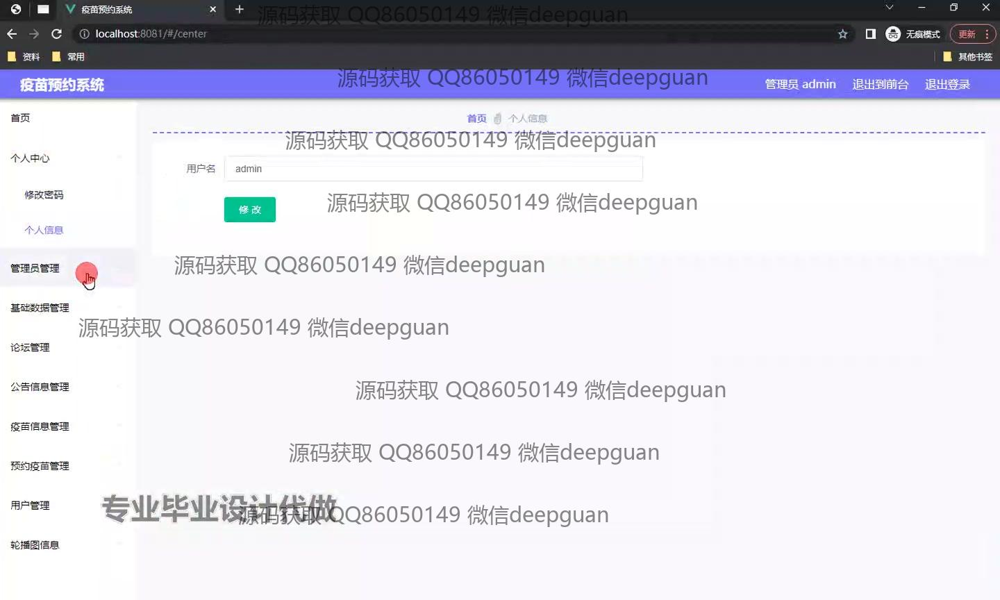
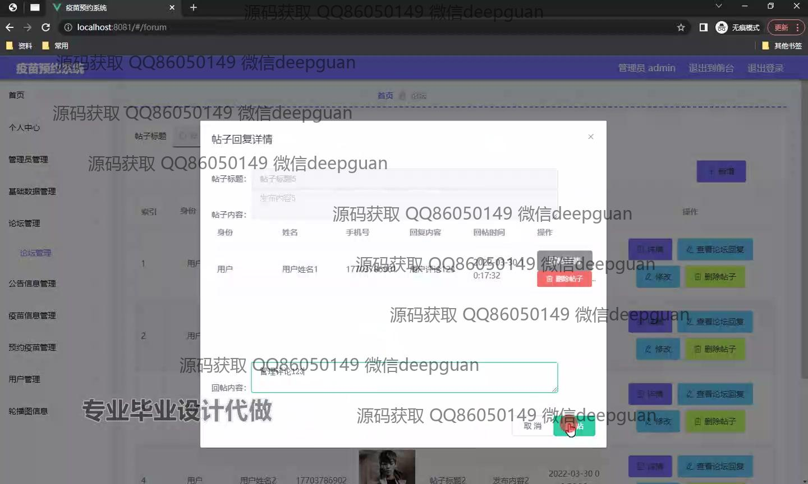
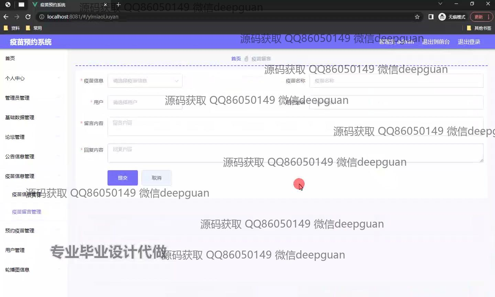
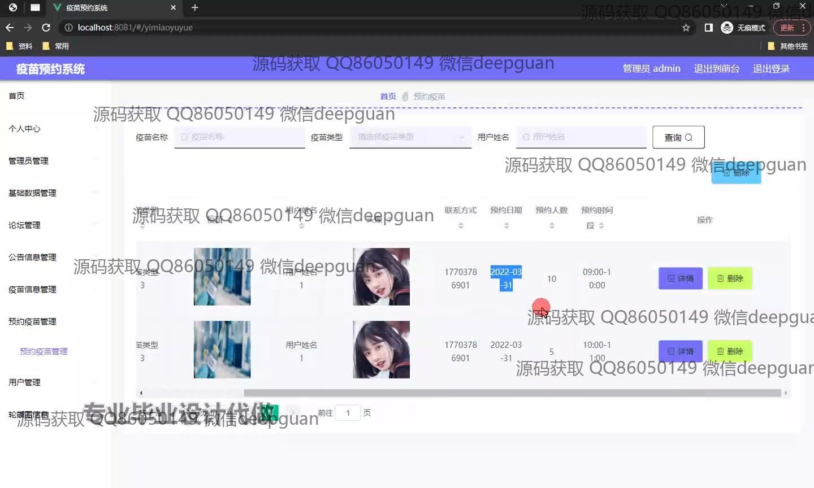
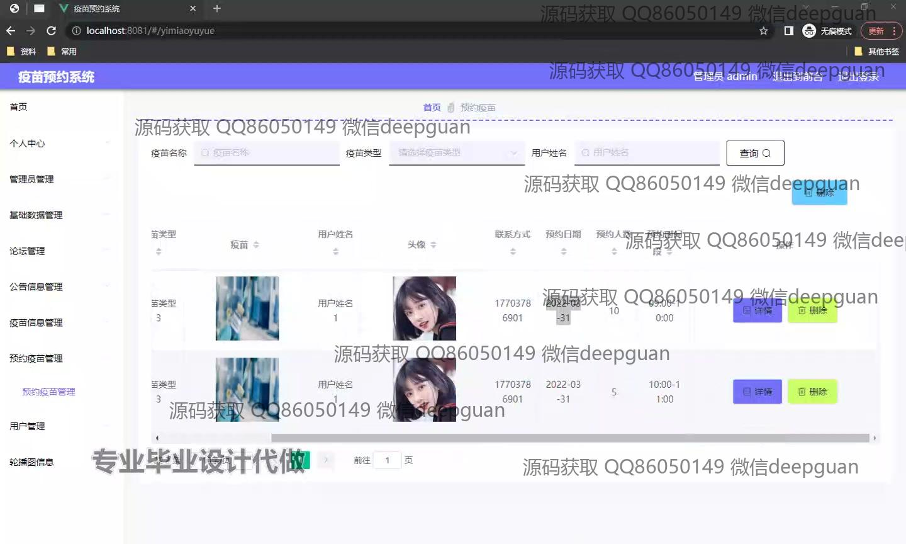
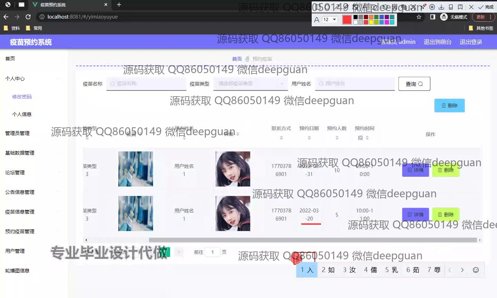
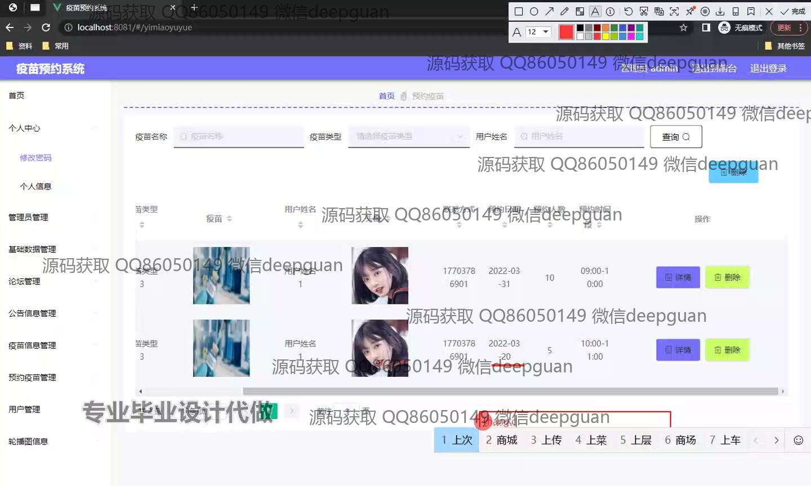
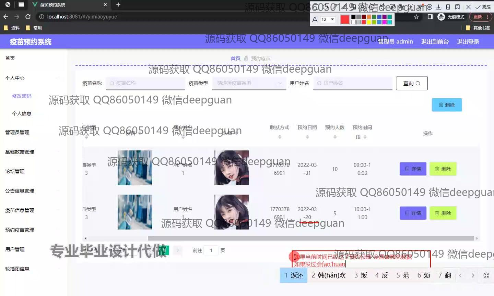
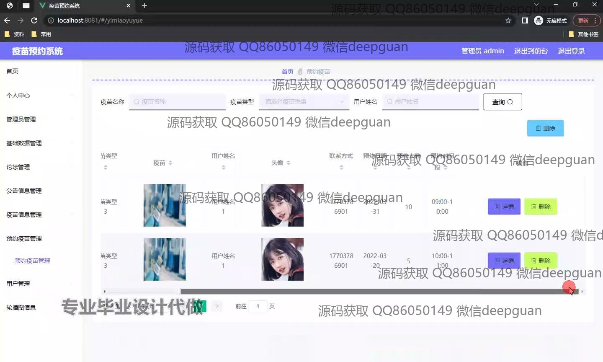
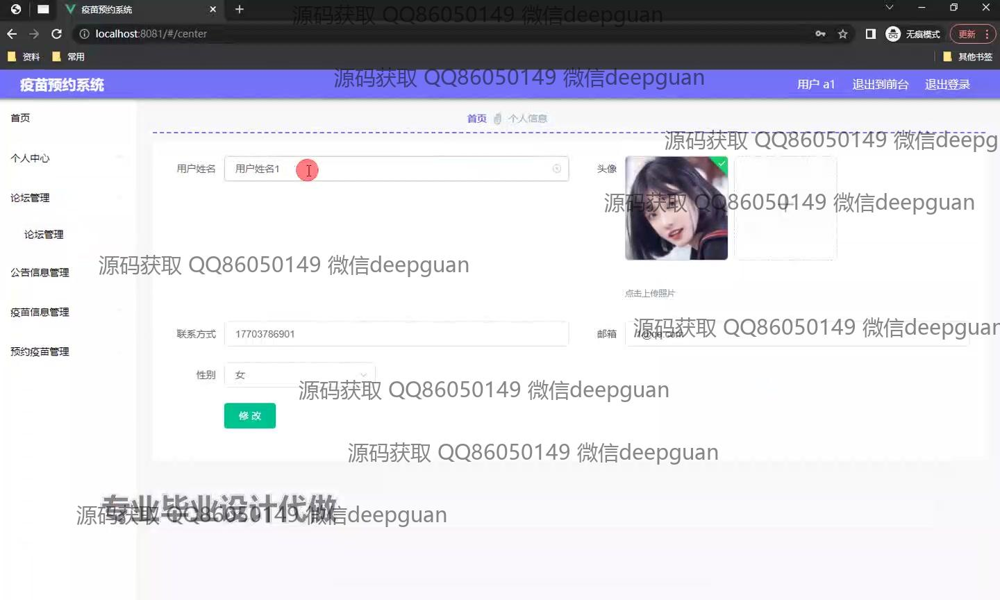
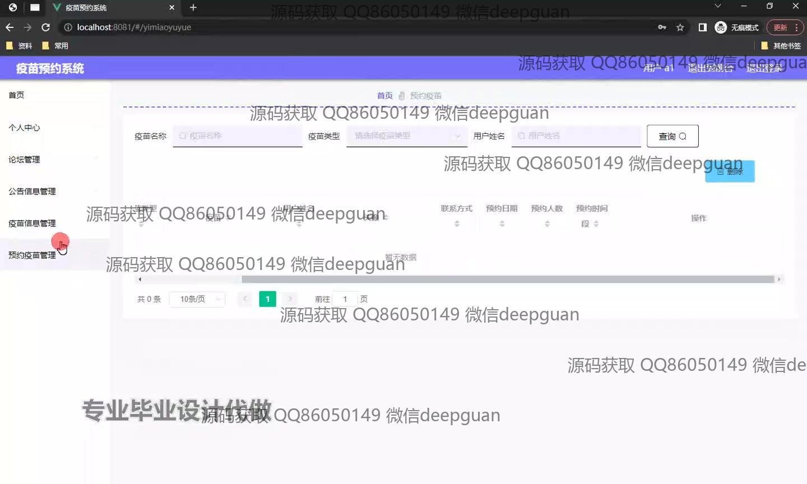

本代码来源于网络,仅供学习参考使用!

